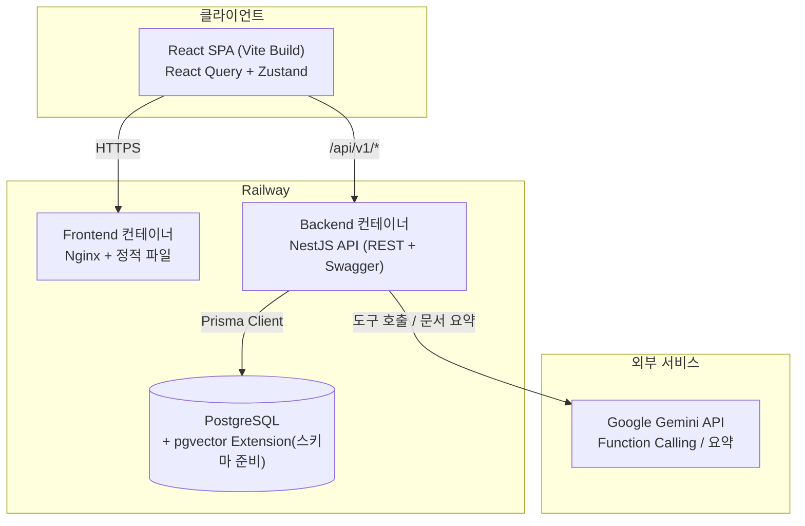

# ERPilot

> Made by 홍민하

**ERP + Copilot** — 기존 ERP 시스템과 AI 사내 업무 도우미를 결합한 B2B SaaS 플랫폼.

ERP 데이터(직원/급여/재고/생산/거래처)를 관리하는 동시에, AI 챗봇을 통해 자연어로 ERP 데이터를 조회하고 사내 문서를 검색할 수 있다. 단순 CRUD 포트폴리오가 아니라, 실제 중소기업 도입을 가정한 **RBAC, 멀티테넌시, 동시성 처리, AI 권한 격리**까지 고려한 실무형 설계를 목표로 한다.

```
"현재 재고가 100개 이하인 품목 알려줘"
"이번 달 매출 요약해줘"
"연차 신청해줘, 다음 주 월요일 하루"
"생산 지연 중인 작업 목록 보여줘"
"김철수 사원의 이번 주 근태 현황 알려줘"
```

## 스크린샷

> 실제 캡처 이미지는 준비 중입니다. 아래는 캡처 예정 화면과 보여주려는 포인트입니다.

| 화면 | 보여주려는 포인트 |
|---|---|
| 로그인 | 데모 계정 원클릭 로그인, 멀티테넌시(회사 단위) 로그인 구조 |
| 대시보드 | 매출 추이, 안전재고 경고, 최근 공지 한눈에 |
| AI 어시스턴트 — 조회 | 자연어 질문 → Function Calling → 실데이터 기반 답변 |
| AI 어시스턴트 — 액션 제안 | "연차 신청해줘" → 확인 카드 → 사용자가 눌러야 최종 반영되는 human-in-the-loop UX |
| FAQ 관리 | AI가 반복 질문을 분석해 만든 후보를 사람이 게시/반려하는 검수 큐 |
| 생산/재고 관리 | 상태 전이(계획→진행→완료)와 안전재고 경고가 있는 실무형 화면 |

## 기술 스택

| 영역 | 스택 |
|---|---|
| Frontend | React 19, TypeScript, Vite, React Query, Zustand, React Router, Tailwind CSS, shadcn/ui, Recharts |
| Backend | NestJS, TypeScript, Prisma, PostgreSQL, JWT, Swagger |
| AI | Google Gemini API(`gemini-2.5-flash`) Function Calling, 역할 기반 도구 오케스트레이션 |
| Infra | Docker(멀티스테이지 빌드), Railway (Frontend/Backend 개별 배포) |

## 아키텍처



**설계와 구현의 차이(의도적 단순화)** — 이 프로젝트는 `docs/09~11`, `docs/13~15`에 처음 목표로 삼은 아키텍처(OpenAI + LangChain, pgvector 유사도 검색, Redis/BullMQ 색인 큐, AWS EC2 + Nginx + GitHub Actions)를 먼저 설계했다. 실제 구현에서는 포트폴리오 규모에 맞춰 다음과 같이 의도적으로 단순화했고, 근거는 코드 주석에 남겨두었다.

| 설계 문서 기준 | 실제 구현 | 이유 |
|---|---|---|
| OpenAI GPT-4o + LangChain | Google Gemini(`@google/genai`) 직접 호출 | 동일한 Function Calling 오케스트레이션을 더 적은 의존성으로 구현 |
| pgvector 임베딩 유사도 검색 | 문서 제목/요약 키워드 매칭 (`DocumentChunk` + `vector(1536)` 컬럼은 스키마에 준비만 해둠) | 별도 색인 파이프라인 없이도 핵심 가치(권한 인지 검색)를 먼저 증명 |
| Redis + BullMQ 비동기 색인 큐 | 온디맨드 동기 처리(관리자가 트리거) | 별도 큐 인프라 없이 동일 기능을 단순 경로로 구현 |
| AWS EC2 + Docker Compose + Nginx + GitHub Actions | Railway (Frontend/Backend 각각 Dockerfile 배포) | 포트폴리오 규모에서 운영 부담을 낮추면서 컨테이너 기반 배포 경험은 유지 |

즉, **AI 계층까지 일관되게 강제하는 RBAC 구조**(아래 참고)는 설계 그대로 구현했고, 그 외 인프라/검색 고도화는 "확장 가능하게 스키마만 준비 + 단순 경로로 우선 구현"하는 방식을 택했다.

## AI 어시스턴트 — 실제 구현 기능

`Gemini 2.5 Flash` function calling 기반 오케스트레이션 (턴당 최대 4회 도구 호출, 최근 대화 10턴 유지).

### 1. 조회(READ) 도구 — 11종

| 분류 | 도구 | 설명 |
|---|---|---|
| 재고 | `getLowStockProducts` / `getInventoryByProduct` | 안전재고 미달 전체 조회 / 특정 제품 창고별 재고 |
| 제품 | `getProductInfo` | 단가·원가·SKU·안전재고 |
| 영업 | `getSalesSummary` | 월별 매출 합계·주문 목록 |
| 거래처 | `getPartnerInfo` | 이름 검색 또는 상위 거래처 목록 |
| 생산 | `getProductionOrdersByStatus` | 상태별 생산 오더(기본: 진행중+지연) |
| 인사 | `getAttendanceSummary` / `getPayrollStatus` / `getLeaveBalance` / `getEmployeeDirectory` | 근태·급여·연차잔액·사내 연락처(본인 우선, ADMIN/HR_MANAGER만 타인 조회) |
| 공지 | `getAnnouncements` | 역할별로 볼 수 있는 공지 |
| 문서 | `searchInternalDocuments` | 사내 문서 제목/요약 키워드 검색 |

### 2. 액션 제안 — "제안 → 사람 확인 → 확정" (3종)

AI는 데이터를 직접 바꾸지 않고 **초안(Draft)만** 만든다. 화면에 뜨는 확인 카드에서 사용자가 직접 눌러야 실제로 반영되며, 10분이 지나면 자동 만료된다.

- `draftLeaveRequest` — 연차/반차/병가 신청 (self-service, 전 역할)
- `draftAnnouncement` — 공지 작성 (`ANNOUNCEMENT:CREATE` 권한자만 노출)
- `draftProductionStatusUpdate` — 생산 오더 상태 변경 (담당자 본인 또는 ADMIN만)

확정(confirm) 시 AI 전용 로직이 아니라 기존 도메인 서비스(`LeaveService.create()` 등)를 그대로 호출해, 수동 화면에서 신청하는 것과 완전히 동일한 검증/트랜잭션 경로를 탄다. 휴가 신청서·공지문은 PDF로 내보낼 수 있다.

### 3. 권한 격리 — 이중 방어

1. **노출 단계**: 호출자의 `RolePermission`에 해당 리소스 `READ` 권한이 없으면 도구 자체를 목록에서 제외 (LLM은 애초에 그 도구의 존재를 모른다)
2. **실행 단계**: `EMPLOYEE`는 조회 대상을 본인으로 강제하고, 모든 쿼리에 `companyId` 스코프를 건다 — LLM이 인자를 잘못/악의적으로 채워도 서버가 실제 권한으로 덮어씀

질문에 포함된 키워드로 관련 도구만 1차로 좁혀 모델에 제공해, 엉뚱한 도구 선택이나 인자 지어내기(hallucination)를 줄인다.

### 4. FAQ 자동화 (Human-in-the-loop)

- 반복 질문을 정규화해 집계한 뒤, 임계치 이상 반복된 그룹만 Gemini로 클러스터링해 대표 질문/답변 후보를 생성
- 모델이 만든 임계치·중복 여부를 서버가 재검증(모델 출력을 그대로 신뢰하지 않는다는 프로젝트 전반의 원칙)
- 후보는 "검수 대기" 상태로 쌓이고, 관리자가 게시/반려하는 사람 검수 큐를 거쳐 사용자에게 노출

## ERP 핵심 업무 화면

| 영역 | 화면 |
|---|---|
| 대시보드 | 매출/재고/공지 요약, AI 어시스턴트 진입 |
| 인사 | 직원 관리, 부서 관리, 권한 관리(RBAC), 급여 관리, 근태(직원 상세 내 포함) |
| 영업/공급망 | 거래처 관리, 제품 관리, 재고 관리, 입출고 관리, 생산 관리, 수주(영업) 관리 |
| 지식/커뮤니케이션 | 문서 관리(업로드 + AI 요약), 공지사항, FAQ 관리 |
| 분석 | 통계 분석 대시보드 |
| 일정 | 멀티데이 일정을 캘린더 바(bar)로 표시하는 일정 관리 |

## 핵심 차별화 포인트

1. **AI 계층까지 일관된 RBAC** — 노출 단계(도구 목록 필터링)와 실행 단계(호출자 실제 권한으로 스코프 강제) 이중 방어. LLM이 잘못된 인자를 만들어도 서버가 신뢰하지 않는다([09](docs/09-ai-chatbot-design.md) 9.3)
2. **정형/비정형 데이터 통합 질의** — ERP DB 조회(Function Calling)와 사내 문서 검색을 한 대화 인터페이스에서 자연스럽게 오간다
3. **제안 → 확인 → 확정 패턴** — AI가 만든 초안은 기존 도메인 서비스의 검증/트랜잭션을 그대로 통과해야 확정되어, "AI가 실수로 데이터를 바꾸는" 리스크를 구조적으로 차단
4. **SaaS 멀티테넌시 설계** — Company 단위 데이터 격리, Role-Permission 매핑으로 회사마다 다른 권한 체계를 지원

## 시작하기

```bash
# 1) DB (PostgreSQL, pgvector extension 필요)
cp apps/backend/.env.example apps/backend/.env   # DATABASE_URL, GEMINI_API_KEY 등 채우기

# 2) Backend
cd apps/backend
npm install
npx prisma migrate dev
npm run prisma:seed          # 회사/역할/권한 + 데모 계정 4종
npm run prisma:seed-demo     # ERP 데모 데이터(직원/재고/생산/거래처 등)
npm run dev                  # http://localhost:3000/api/v1 (Swagger: /api/v1/docs)

# 3) Frontend
cd apps/frontend
npm install
npm run dev                  # http://localhost:5173
```

데모 계정(로그인 화면에서 원클릭 채우기 지원, 비밀번호 기본 `erpilot1234!`):

| 역할 | 이메일 |
|---|---|
| ADMIN | doyoon.kim@erpilot.io |
| HR_MANAGER | yujin.choi@erpilot.io |
| SALES_MANAGER | minjun.kim@erpilot.io |
| EMPLOYEE | jihoon.park@erpilot.io |

## 문서 목차

설계 초기에 목표 아키텍처를 폭넓게 정리한 문서들이다. 위 "아키텍처" 섹션의 표에 정리했듯, `09`~`11`·`13`~`15`는 실제 구현보다 더 큰 목표 설계(OpenAI/LangChain/pgvector 유사도 검색/AWS 배포 등)를 담고 있다 — 왜 그렇게 설계했는지, 그리고 실제로는 왜/어떻게 단순화했는지 함께 보면 설계와 구현 사이의 트레이드오프 판단 과정을 볼 수 있다.

| # | 문서 | 내용 |
|---|---|---|
| 1 | [프로젝트 개요](docs/01-overview.md) | 목표, 해결 문제, 기대 효과, 차별화 포인트 |
| 2 | [사용자 정의](docs/02-users-and-permissions.md) | 4개 역할 페르소나 및 권한 매트릭스 |
| 3 | [기능 명세](docs/03-feature-spec.md) | ERP 핵심 모듈 + AI 기능 상세 |
| 4 | [화면 설계](docs/04-screen-design.md) | 전 페이지 목적/기능/구조/UI/흐름 |
| 5 | [UX/UI 디자인 시스템](docs/05-design-system.md) | 컬러/타이포/스페이싱/컴포넌트 정의 |
| 6 | [디자인 시안](docs/06-wireframes.md) | 1440px ASCII 와이어프레임 7종 |
| 7 | [데이터베이스 설계](docs/07-database-design.md) | ERD, 테이블, 인덱스, Prisma Schema |
| 8 | [API 설계](docs/08-api-design.md) | NestJS 모듈 구조, Endpoint, Swagger |
| 9 | [AI 챗봇 설계](docs/09-ai-chatbot-design.md) | Function Calling, RBAC 강제, 프롬프트 전략 (목표 설계) |
| 10 | [RAG 설계](docs/10-rag-design.md) | 업로드~답변생성 전체 파이프라인 (목표 설계) |
| 11 | [pgvector 설계](docs/11-pgvector-design.md) | 테이블/인덱스/유사도 검색 SQL (목표 설계, 스키마만 반영) |
| 12 | [JWT 인증 설계](docs/12-jwt-auth-design.md) | Access/Refresh Token, Guard, 보안 |
| 13 | [시스템 아키텍처](docs/13-system-architecture.md) | 목표 아키텍처 구조도 및 요청 흐름 |
| 14 | [배포 아키텍처](docs/14-deployment-architecture.md) | 목표 배포안(AWS 기준) — 실제 배포는 Railway |
| 15 | [포트폴리오 발표 자료](docs/15-portfolio-presentation.md) | 면접 대비 발표 스크립트(목표 설계 기준, 위 표 참고) |
