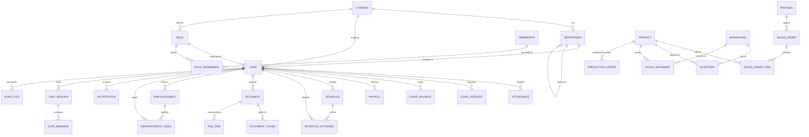

# 7. 데이터베이스 설계

ERPilot은 멀티테넌시 SaaS를 전제로 하므로, 최상위에 `Company`(워크스페이스) 엔티티를 두고 주요 마스터 테이블에 `companyId`를 직접 보유하는 구조로 설계했다. 총 29개 테이블로 구성되며, 단순 CRUD 게시판형 스키마가 아니라 **상태 전이, 원장(Ledger) 패턴, RBAC 매핑, 벡터 검색**을 포함한다.

## 7.1 ERD (Mermaid)



## 7.2 테이블 그룹 개요

| 그룹 | 테이블 | 설명 |
|---|---|---|
| Tenant/Org | `Company`, `Department` | 워크스페이스, 조직 구조 |
| RBAC | `Role`, `Permission`, `RolePermission`, `User` | 사용자 및 권한 모델 |
| HR | `Attendance`, `LeaveRequest`, `LeaveBalance`, `Payroll` | 근태/휴가/급여 |
| Schedule | `Schedule`, `ScheduleAttendee` | 일정 |
| Sales/Partner | `Partner`, `SalesOrder`, `SalesOrderItem` | 거래처/영업 |
| Product/Inventory | `Product`, `Warehouse`, `Inventory`, `StockMovement`, `ProductionOrder` | 제품/재고/생산 |
| Knowledge | `Document`, `DocumentChunk` | 문서 및 RAG 색인 |
| Communication | `Announcement`, `AnnouncementRead`, `Notification` | 공지/알림 |
| AI | `ChatSession`, `ChatMessage`, `FaqItem` | AI 챗봇 이력 및 FAQ |
| Compliance | `AuditLog` | 감사 로그 |

## 7.3 데이터 딕셔너리

### Tenant / Org

**Company**
| 컬럼 | 타입 | 설명 |
|---|---|---|
| id | uuid PK | |
| name | varchar | 회사명 |
| bizRegNo | varchar | 사업자번호 |
| plan | enum(FREE,PRO,ENTERPRISE) | 구독 플랜 |
| createdAt | timestamp | |

**Department**
| 컬럼 | 타입 | 설명 |
|---|---|---|
| id | uuid PK | |
| companyId | uuid FK→Company | |
| name | varchar | |
| parentId | uuid FK→Department(self), nullable | 상위 부서 |
| managerId | uuid FK→User, nullable | 부서장 |

### RBAC

**Role** : id, companyId FK, name, description, isSystem(boolean, 기본 4종 여부)
**Permission** : id, resource(varchar, 예: "PAYROLL"), action(enum: CREATE/READ/UPDATE/DELETE/APPROVE)
**RolePermission** : id, roleId FK, permissionId FK *(unique [roleId, permissionId])*

**User**
| 컬럼 | 타입 | 설명 |
|---|---|---|
| id | uuid PK | |
| companyId | uuid FK→Company | |
| employeeNo | varchar | 사번 |
| email | varchar | 로그인 ID |
| passwordHash | varchar | bcrypt 해시 |
| name | varchar | |
| phone | varchar, nullable | |
| departmentId | uuid FK→Department, nullable | |
| roleId | uuid FK→Role | |
| position | varchar | 직급 |
| hireDate | date | |
| status | enum(ACTIVE,ON_LEAVE,RESIGNED) | 소프트 삭제용 |
| refreshTokenHash | varchar, nullable | 해시된 Refresh Token (회전 검증용) |
| createdAt / updatedAt | timestamp | |

### HR

**Attendance** : id, userId FK, workDate(date), checkInAt, checkOutAt, status(enum: NORMAL/LATE/ABSENT/REMOTE/BUSINESS_TRIP), workMinutes(int) — *unique [userId, workDate]*
**LeaveRequest** : id, userId FK, type(enum: ANNUAL/SICK/SPECIAL/UNPAID), startDate, endDate, days(decimal), reason, status(enum: PENDING/APPROVED/REJECTED), approverId FK→User nullable, createdAt
**LeaveBalance** : id, userId FK, year(int), totalDays(decimal), usedDays(decimal), remainingDays(decimal) — *unique [userId, year]*
**Payroll** : id, userId FK, payYear, payMonth, baseSalary(decimal), allowances(jsonb), deductions(jsonb), netSalary(decimal), status(enum: DRAFT/CONFIRMED/PAID), confirmedAt, paidAt, createdBy FK→User — *unique [userId, payYear, payMonth]*

### Schedule

**Schedule** : id, companyId FK, ownerId FK→User, title, description, type(enum: MEETING/VACATION/BUSINESS_TRIP/ETC), startAt, endAt, allDay(boolean), location, departmentId FK nullable, visibility(enum: PRIVATE/DEPARTMENT/COMPANY)
**ScheduleAttendee** : id, scheduleId FK, userId FK, status(enum: PENDING/ACCEPTED/DECLINED) — *unique [scheduleId, userId]*

### Sales / Partner

**Partner** : id, companyId FK, name, bizRegNo, type(enum: CUSTOMER/VENDOR/BOTH), ceoName, phone, email, address, grade(enum: A/B/C), managerId FK→User — *unique [companyId, bizRegNo]*
**SalesOrder** : id, companyId FK, orderNo, partnerId FK, orderDate, status(enum: QUOTE/CONFIRMED/SHIPPED/INVOICED/CANCELLED), totalAmount(decimal), createdBy FK→User
**SalesOrderItem** : id, salesOrderId FK, productId FK, quantity(int), unitPrice(decimal), amount(decimal)

### Product / Inventory / Production

**Product** : id, companyId FK, sku, name, category, spec, unit, salePrice(decimal), costPrice(decimal), safetyStock(int), isActive(boolean) — *unique [companyId, sku]*
**Warehouse** : id, companyId FK, name, location, managerId FK→User
**Inventory** : id, productId FK, warehouseId FK, quantity(int), updatedAt — *unique [productId, warehouseId]*
**StockMovement** : id, productId FK, warehouseId FK, type(enum: IN/OUT/ADJUST/TRANSFER), quantity(int), refType(enum: PURCHASE/SALES/PRODUCTION/RETURN/ADJUSTMENT), refId(uuid, nullable), memo, createdBy FK→User, createdAt
**ProductionOrder** : id, companyId FK, orderNo, productId FK, plannedQty(int), producedQty(int), status(enum: PLANNED/IN_PROGRESS/DELAYED/COMPLETED/CANCELLED), lineName, startDate, dueDate, managerId FK→User, createdAt

### Knowledge (RAG 연계)

**Document** : id, companyId FK, title, category(enum: POLICY/CONTRACT/REPORT/MANUAL/HR/ETC), fileUrl, fileType, fileSize(int), version(int), status(enum: DRAFT/PUBLISHED/ARCHIVED), indexStatus(enum: PENDING/PROCESSING/DONE/FAILED), isPublic(boolean), departmentId FK nullable, uploadedBy FK→User, createdAt, updatedAt
**DocumentChunk** : id, documentId FK, chunkIndex(int), content(text), tokenCount(int), embedding(`vector(1536)`), metadata(jsonb), createdAt

### Communication

**Announcement** : id, companyId FK, title, content(text/markdown), category, isPinned(boolean), targetRole FK→Role nullable(null=전사), authorId FK→User, publishedAt, createdAt
**AnnouncementRead** : id, announcementId FK, userId FK, readAt — *unique [announcementId, userId]*
**Notification** : id, userId FK, type, title, message, link, isRead(boolean), createdAt

### AI

**ChatSession** : id, userId FK, title, createdAt, updatedAt
**ChatMessage** : id, sessionId FK, role(enum: USER/ASSISTANT/SYSTEM/FUNCTION), content(text), functionName(varchar, nullable), functionArgs(jsonb, nullable), functionResult(jsonb, nullable), tokenUsage(int, nullable), createdAt
**FaqItem** : id, companyId FK, question, answer, category, hitCount(int), sourceType(enum: AI_GENERATED/MANUAL), sourceDocumentId FK→Document nullable, isPublished(boolean), createdAt, updatedAt

### Compliance

**AuditLog** : id, companyId FK, userId FK nullable, action(varchar, 예: "PAYROLL_CONFIRM"), resource(varchar), resourceId(uuid, nullable), ipAddress(varchar), metadata(jsonb, nullable), createdAt

## 7.4 관계 정의 요약

- `Company 1 : N Department/User/Role/Partner/Product/Warehouse/Document/Announcement/...` — 모든 1차 마스터는 `companyId`를 직접 보유 (멀티테넌시 격리)
- `Department 1 : N Department` — 자기참조로 상위/하위 부서 트리 구성
- `Role N : M Permission` — `RolePermission` 매핑 테이블을 통한 다대다
- `User 1 : N Attendance/LeaveRequest/Payroll/Schedule(owner)/ChatSession/AuditLog`
- `Schedule N : M User` — `ScheduleAttendee`를 통한 다대다(참석자)
- `Partner 1 : N SalesOrder`, `SalesOrder 1 : N SalesOrderItem N : 1 Product`
- `Product 1 : N Inventory N : 1 Warehouse` (제품-창고 조합당 1개 재고 레코드)
- `Product/Warehouse 1 : N StockMovement` — 입출고 트랜잭션 원장
- `Document 1 : N DocumentChunk` — RAG 색인 단위
- `Announcement N : M User` — `AnnouncementRead`를 통한 읍음 확인
- `ChatSession 1 : N ChatMessage`

## 7.5 인덱스 설계

| 테이블 | 인덱스 | 목적 |
|---|---|---|
| User | unique(companyId, email) | 로그인 조회, 테넌트 내 이메일 중복 방지 |
| Attendance | unique(userId, workDate) | 1인 1일 1건 보장, 근태 조회 성능 |
| Payroll | unique(userId, payYear, payMonth) | 중복 생성 방지, 월별 급여 조회 |
| Schedule | index(companyId, startAt) | 캘린더 기간 조회 |
| ScheduleAttendee | unique(scheduleId, userId) | 중복 초대 방지 |
| Partner | unique(companyId, bizRegNo) | 거래처 중복 등록 방지 |
| Product | unique(companyId, sku) | SKU 중복 방지 |
| Inventory | unique(productId, warehouseId) | 재고 단일 진실 공급원(Single Source of Truth) 보장 |
| StockMovement | index(productId, createdAt), index(warehouseId) | 제품별 이력 조회, 창고별 집계 |
| ProductionOrder | index(status, dueDate) | "지연 오더" 조회(AI Function Calling의 핵심 질의 경로) |
| DocumentChunk | index(documentId) + **HNSW vector index on embedding** | 문서별 청크 조회 + 유사도 검색 ([11-pgvector-design.md](11-pgvector-design.md)) |
| ChatMessage | index(sessionId, createdAt) | 세션 내 시간순 메시지 로딩 |
| AnnouncementRead | unique(announcementId, userId) | 중복 읍음 처리 방지 |
| AuditLog | index(companyId, createdAt), index(resource, resourceId) | 감사 추적 조회, 특정 리소스 변경 이력 추적 |

## 7.6 설계 이유

1. **`companyId` 비정규화(denormalization)**: 멀티테넌시 SaaS에서 모든 조회가 `WHERE company_id = $1`로 시작되므로, 조인 체인을 타지 않고 1차 테이블에서 바로 필터링되도록 주요 마스터에 `companyId`를 직접 둔다. 추후 Postgres **Row-Level Security(RLS)** 정책을 `company_id = current_setting('app.current_company_id')` 기준으로 적용해 애플리케이션 버그로 인한 테넌트 간 데이터 유출을 DB 레벨에서 2차 방어한다.
2. **소프트 삭제 원칙**: `User.status`, `Product.isActive`처럼 실제 행을 삭제하지 않는다. 퇴사한 직원의 과거 급여/근태, 단종된 제품의 과거 주문 이력처럼 **과거 트랜잭션의 참조 무결성**이 깨지면 회계/인사 감사 대응이 불가능해지기 때문이다.
3. **JSON 컬럼의 제한적 사용**: `Payroll.allowances/deductions`, `DocumentChunk.metadata`, `ChatMessage.functionArgs/functionResult`처럼 **항목 구성이 회사마다, 시점마다 달라질 수 있는 영역에만** JSON을 사용한다. 반대로 통계/정렬/필터가 빈번한 핵심 수치(`netSalary`, `quantity`)는 반드시 별도 컬럼으로 분리해 인덱스와 집계 쿼리 성능을 확보한다 — "유연성과 쿼리 성능"의 트레이드오프를 컬럼 단위로 판단했다.
4. **`StockMovement`는 Append-only 원장 패턴**: 재고는 "현재 수량"(`Inventory.quantity`)과 "변동 이력"(`StockMovement`)을 동시에 정확히 유지해야 한다. 입출고 등록 시 `StockMovement` insert와 `Inventory` upsert를 **하나의 DB 트랜잭션**으로 묶고, 동시 출고 요청으로 인한 음수 재고를 막기 위해 `SELECT ... FOR UPDATE` 비관적 락(또는 Prisma `$transaction` + Serializable 격리수준)을 사용한다.
5. **상태 전이를 명시적 Enum으로 모델링**: `Payroll(DRAFT→CONFIRMED→PAID)`, `ProductionOrder(PLANNED→IN_PROGRESS→DELAYED→COMPLETED)`처럼 boolean 플래그 조합이 아니라 단일 상태 컬럼으로 설계하여, 화면의 상태 Badge/Kanban 컬럼과 DB 상태가 1:1로 매핑되고 잘못된 상태 전이를 서비스 레이어에서 검증하기 쉽게 한다.
6. **`embedding vector(1536)` 컬럼**: Prisma Client는 `vector` 타입을 1급으로 지원하지 않으므로 `Unsupported("vector(1536)")`로 선언해 마이그레이션에는 포함시키되, 실제 유사도 검색은 `$queryRaw`로 직접 SQL을 실행한다(상세: [11-pgvector-design.md](11-pgvector-design.md)).
7. **`AuditLog`는 메인 트랜잭션과 분리**: 급여 확정, 권한 변경처럼 민감한 액션에 대해서만 기록하며, NestJS Interceptor에서 비동기(fire-and-forget 큐 또는 트랜잭션 커밋 후 처리)로 적재하여 핵심 비즈니스 트랜잭션의 응답 지연에 영향을 주지 않도록 한다.

## 7.7 Prisma Schema 예시

```prisma
generator client {
  provider        = "prisma-client-js"
  previewFeatures = ["postgresqlExtensions"]
}

datasource db {
  provider   = "postgresql"
  url        = env("DATABASE_URL")
  extensions = [pgvector(map: "vector", schema: "public")]
}

// ── Tenant / Org ─────────────────────────────────────────
model Company {
  id        String   @id @default(uuid())
  name      String
  bizRegNo  String   @unique
  plan      Plan     @default(FREE)
  createdAt DateTime @default(now())

  departments Department[]
  users       User[]
  roles       Role[]

  @@map("companies")
}

enum Plan {
  FREE
  PRO
  ENTERPRISE
}

model Department {
  id        String   @id @default(uuid())
  companyId String
  name      String
  parentId  String?
  managerId String?

  company  Company      @relation(fields: [companyId], references: [id])
  parent   Department?  @relation("DeptHierarchy", fields: [parentId], references: [id])
  children Department[] @relation("DeptHierarchy")
  users    User[]

  @@index([companyId])
  @@map("departments")
}

// ── RBAC ──────────────────────────────────────────────────
model Role {
  id          String   @id @default(uuid())
  companyId   String
  name        String
  description String?
  isSystem    Boolean  @default(false)

  company         Company          @relation(fields: [companyId], references: [id])
  users           User[]
  rolePermissions RolePermission[]

  @@unique([companyId, name])
  @@map("roles")
}

model Permission {
  id       String            @id @default(uuid())
  resource String
  action   PermissionAction

  rolePermissions RolePermission[]

  @@unique([resource, action])
  @@map("permissions")
}

enum PermissionAction {
  CREATE
  READ
  UPDATE
  DELETE
  APPROVE
}

model RolePermission {
  id           String @id @default(uuid())
  roleId       String
  permissionId String

  role       Role       @relation(fields: [roleId], references: [id], onDelete: Cascade)
  permission Permission @relation(fields: [permissionId], references: [id], onDelete: Cascade)

  @@unique([roleId, permissionId])
  @@map("role_permissions")
}

model User {
  id               String     @id @default(uuid())
  companyId        String
  employeeNo       String
  email            String
  passwordHash     String
  name             String
  phone            String?
  departmentId     String?
  roleId           String
  position         String?
  hireDate         DateTime?
  status           UserStatus @default(ACTIVE)
  refreshTokenHash String?
  createdAt        DateTime   @default(now())
  updatedAt        DateTime   @updatedAt

  company      Company        @relation(fields: [companyId], references: [id])
  department   Department?    @relation(fields: [departmentId], references: [id])
  role         Role           @relation(fields: [roleId], references: [id])
  attendances  Attendance[]
  leaveRequests LeaveRequest[]
  payrolls     Payroll[]
  chatSessions ChatSession[]
  auditLogs    AuditLog[]

  @@unique([companyId, email])
  @@unique([companyId, employeeNo])
  @@index([departmentId])
  @@map("users")
}

enum UserStatus {
  ACTIVE
  ON_LEAVE
  RESIGNED
}

// ── HR ────────────────────────────────────────────────────
model Attendance {
  id          String           @id @default(uuid())
  userId      String
  workDate    DateTime         @db.Date
  checkInAt   DateTime?
  checkOutAt  DateTime?
  status      AttendanceStatus @default(NORMAL)
  workMinutes Int?

  user User @relation(fields: [userId], references: [id])

  @@unique([userId, workDate])
  @@map("attendances")
}

enum AttendanceStatus {
  NORMAL
  LATE
  ABSENT
  REMOTE
  BUSINESS_TRIP
}

model LeaveRequest {
  id         String      @id @default(uuid())
  userId     String
  type       LeaveType
  startDate  DateTime    @db.Date
  endDate    DateTime    @db.Date
  days       Decimal     @db.Decimal(4, 1)
  reason     String?
  status     LeaveStatus @default(PENDING)
  approverId String?
  createdAt  DateTime    @default(now())

  user User @relation(fields: [userId], references: [id])

  @@index([userId, status])
  @@map("leave_requests")
}

enum LeaveType {
  ANNUAL
  SICK
  SPECIAL
  UNPAID
}

enum LeaveStatus {
  PENDING
  APPROVED
  REJECTED
}

model Payroll {
  id          String        @id @default(uuid())
  userId      String
  payYear     Int
  payMonth    Int
  baseSalary  Decimal       @db.Decimal(12, 0)
  allowances  Json          @default("{}")
  deductions  Json          @default("{}")
  netSalary   Decimal       @db.Decimal(12, 0)
  status      PayrollStatus @default(DRAFT)
  confirmedAt DateTime?
  paidAt      DateTime?
  createdBy   String

  user User @relation(fields: [userId], references: [id])

  @@unique([userId, payYear, payMonth])
  @@map("payrolls")
}

enum PayrollStatus {
  DRAFT
  CONFIRMED
  PAID
}

// ── Product / Inventory / Production ─────────────────────
model Product {
  id          String   @id @default(uuid())
  companyId   String
  sku         String
  name        String
  category    String?
  spec        String?
  unit        String
  salePrice   Decimal  @db.Decimal(12, 0)
  costPrice   Decimal  @db.Decimal(12, 0)
  safetyStock Int      @default(0)
  isActive    Boolean  @default(true)

  inventories      Inventory[]
  stockMovements   StockMovement[]
  productionOrders ProductionOrder[]
  salesOrderItems  SalesOrderItem[]

  @@unique([companyId, sku])
  @@map("products")
}

model Warehouse {
  id        String @id @default(uuid())
  companyId String
  name      String
  location  String?
  managerId String?

  inventories    Inventory[]
  stockMovements StockMovement[]

  @@map("warehouses")
}

model Inventory {
  id          String   @id @default(uuid())
  productId   String
  warehouseId String
  quantity    Int      @default(0)
  updatedAt   DateTime @updatedAt

  product   Product   @relation(fields: [productId], references: [id])
  warehouse Warehouse @relation(fields: [warehouseId], references: [id])

  @@unique([productId, warehouseId])
  @@map("inventories")
}

model StockMovement {
  id          String             @id @default(uuid())
  productId   String
  warehouseId String
  type        StockMovementType
  quantity    Int
  refType     StockRefType
  refId       String?
  memo        String?
  createdBy   String
  createdAt   DateTime           @default(now())

  product   Product   @relation(fields: [productId], references: [id])
  warehouse Warehouse @relation(fields: [warehouseId], references: [id])

  @@index([productId, createdAt])
  @@index([warehouseId])
  @@map("stock_movements")
}

enum StockMovementType {
  IN
  OUT
  ADJUST
  TRANSFER
}

enum StockRefType {
  PURCHASE
  SALES
  PRODUCTION
  RETURN
  ADJUSTMENT
}

model ProductionOrder {
  id         String           @id @default(uuid())
  companyId  String
  orderNo    String
  productId  String
  plannedQty Int
  producedQty Int             @default(0)
  status     ProductionStatus @default(PLANNED)
  lineName   String?
  startDate  DateTime         @db.Date
  dueDate    DateTime         @db.Date
  managerId  String?
  createdAt  DateTime         @default(now())

  product Product @relation(fields: [productId], references: [id])

  @@index([status, dueDate])
  @@map("production_orders")
}

enum ProductionStatus {
  PLANNED
  IN_PROGRESS
  DELAYED
  COMPLETED
  CANCELLED
}

// ── Knowledge / RAG ───────────────────────────────────────
model Document {
  id           String           @id @default(uuid())
  companyId    String
  title        String
  category     DocumentCategory
  fileUrl      String
  fileType     String
  fileSize     Int
  version      Int              @default(1)
  status       DocumentStatus   @default(DRAFT)
  indexStatus  IndexStatus      @default(PENDING)
  isPublic     Boolean          @default(true)
  departmentId String?
  uploadedBy   String
  createdAt    DateTime         @default(now())
  updatedAt    DateTime         @updatedAt

  chunks   DocumentChunk[]
  faqItems FaqItem[]

  @@index([companyId, category])
  @@map("documents")
}

enum DocumentCategory {
  POLICY
  CONTRACT
  REPORT
  MANUAL
  HR
  ETC
}

enum DocumentStatus {
  DRAFT
  PUBLISHED
  ARCHIVED
}

enum IndexStatus {
  PENDING
  PROCESSING
  DONE
  FAILED
}

model DocumentChunk {
  id         String                  @id @default(uuid())
  documentId String
  chunkIndex Int
  content    String
  tokenCount Int
  embedding  Unsupported("vector(1536)")
  metadata   Json?
  createdAt  DateTime                @default(now())

  document Document @relation(fields: [documentId], references: [id], onDelete: Cascade)

  @@index([documentId])
  @@map("document_chunks")
}

// ── AI ────────────────────────────────────────────────────
model ChatSession {
  id        String   @id @default(uuid())
  userId    String
  title     String?
  createdAt DateTime @default(now())
  updatedAt DateTime @updatedAt

  user     User          @relation(fields: [userId], references: [id])
  messages ChatMessage[]

  @@index([userId])
  @@map("chat_sessions")
}

model ChatMessage {
  id             String   @id @default(uuid())
  sessionId      String
  role           ChatRole
  content        String
  functionName   String?
  functionArgs   Json?
  functionResult Json?
  tokenUsage     Int?
  createdAt      DateTime @default(now())

  session ChatSession @relation(fields: [sessionId], references: [id], onDelete: Cascade)

  @@index([sessionId, createdAt])
  @@map("chat_messages")
}

enum ChatRole {
  USER
  ASSISTANT
  SYSTEM
  FUNCTION
}

model FaqItem {
  id               String        @id @default(uuid())
  companyId        String
  question         String
  answer           String
  category         String?
  hitCount         Int           @default(0)
  sourceType       FaqSourceType @default(MANUAL)
  sourceDocumentId String?
  isPublished      Boolean       @default(false)
  createdAt        DateTime      @default(now())
  updatedAt        DateTime      @updatedAt

  sourceDocument Document? @relation(fields: [sourceDocumentId], references: [id])

  @@index([companyId, category])
  @@map("faq_items")
}

enum FaqSourceType {
  AI_GENERATED
  MANUAL
}

// ── Compliance ────────────────────────────────────────────
model AuditLog {
  id         String   @id @default(uuid())
  companyId  String
  userId     String?
  action     String
  resource   String
  resourceId String?
  ipAddress  String?
  metadata   Json?
  createdAt  DateTime @default(now())

  user User? @relation(fields: [userId], references: [id])

  @@index([companyId, createdAt])
  @@index([resource, resourceId])
  @@map("audit_logs")
}
```

> 위 스키마는 핵심 도메인을 모두 포함하지만 지면상 `Schedule`, `Partner`, `SalesOrder` 등 일부 모델의 전체 필드는 [7.3 데이터 딕셔너리](#73-데이터-딕셔너리)를 기준으로 동일한 패턴(Company 격리, Enum 상태, 인덱스)으로 확장한다. `vector` 컬럼이 포함된 마이그레이션은 Prisma Migrate 생성 SQL에 `CREATE EXTENSION IF NOT EXISTS vector;`와 HNSW 인덱스 생성문을 수동으로 추가해야 한다([11-pgvector-design.md](11-pgvector-design.md) 참고).
