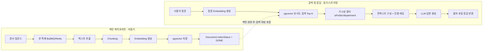

# 10. RAG 설계

## 10.1 전체 파이프라인 개요



## 10.2 문서 업로드

- 업로드 API(`POST /documents`)는 파일을 S3(또는 EC2 로컬 볼륨 + Nginx static serving, 포트폴리오 환경에서는 로컬 볼륨도 허용)에 저장하고 `Document` 레코드를 `indexStatus = PENDING`으로 즉시 생성, **202 Accepted 응답을 먼저 반환**한다.
- 업로드 직후 `documentId`를 메시지로 BullMQ 큐(`document-indexing`)에 적재하여 색인은 완전히 비동기로 처리한다 — 대용량 PDF 파싱/임베딩이 API 응답 시간에 영향을 주지 않도록 하기 위함이다.
- 지원 포맷: PDF, DOCX, TXT, Markdown (초기 버전). 이미지 기반 스캔 PDF는 OCR이 필요하므로 1차 범위에서는 제외하고 로드맵으로 명시.

## 10.3 텍스트 추출

| 포맷 | 라이브러리 | 비고 |
|---|---|---|
| PDF | `pdf-parse` | 페이지 단위 텍스트 + 페이지 번호 메타데이터 보존 |
| DOCX | `mammoth` | 문단/헤딩 구조를 Markdown으로 변환 후 처리 |
| TXT/MD | 직접 읽기 | 인코딩 UTF-8 강제 |

```typescript
// rag/extractors/extract-text.ts
export async function extractText(file: Buffer, mimeType: string): Promise<ExtractedPage[]> {
  if (mimeType === 'application/pdf') {
    const data = await pdfParse(file);
    return data.pages.map((p, idx) => ({ pageNumber: idx + 1, text: p.text }));
  }
  if (mimeType === 'application/vnd.openxmlformats-officedocument.wordprocessingml.document') {
    const { value } = await mammoth.extractRawText({ buffer: file });
    return [{ pageNumber: null, text: value }];
  }
  return [{ pageNumber: null, text: file.toString('utf-8') }];
}
```

## 10.4 Chunking

- **전략**: `RecursiveCharacterTextSplitter` (LangChain) — 문단(`\n\n`) → 줄바꿈(`\n`) → 문장(`.`, `다.`) → 어절 순으로 재귀적으로 분할하여 의미 단위가 최대한 보존되도록 한다.
- **크기**: `chunkSize = 500 tokens`, `chunkOverlap = 50 tokens` (tiktoken `cl100k_base` 기준 카운트)
  - 너무 작으면(예: 100 토큰) 문맥이 끊겨 "신입사원 연차 규정" 같은 질문에서 조항의 앞뒤 조건이 분리될 위험이 있고, 너무 크면(예: 2000 토큰) 검색 정밀도가 떨어지고 LLM 컨텍스트 비용이 증가한다. 500/50은 사내 정책 문서(조항 단위 평균 300~600자) 특성에 맞춘 실험적 절충값이다.
- **메타데이터 보존**: 각 Chunk는 `{ documentId, chunkIndex, pageNumber, sectionTitle? }`를 `metadata(jsonb)`에 함께 저장하여, 답변 생성 시 "OO 문서 3페이지"처럼 정확한 출처 인용이 가능하도록 한다.

```typescript
const splitter = new RecursiveCharacterTextSplitter({
  chunkSize: 500,
  chunkOverlap: 50,
  separators: ['\n\n', '\n', '. ', '다. ', ' '],
});

const chunks = await splitter.splitText(pageText);
const chunkRecords = chunks.map((content, idx) => ({
  documentId,
  chunkIndex: idx,
  content,
  tokenCount: countTokens(content),
  metadata: { pageNumber: page.pageNumber },
}));
```

## 10.5 Embedding 생성

- **모델**: `text-embedding-3-small` (1536차원, [07-database-design.md](07-database-design.md)의 `vector(1536)` 컬럼과 일치). 한국어 문서에 대한 성능/비용 균형이 좋아 1차 선택, 검색 품질이 부족할 경우 `text-embedding-3-large`(3072차원)로 업그레이드할 수 있도록 컬럼 차원을 마이그레이션으로 분리 설계.
- **배치 처리**: OpenAI Embedding API는 1회 요청에 다건 입력을 지원하므로, Chunk를 100개 단위로 배치 호출하여 API 호출 횟수와 Rate Limit 부담을 최소화한다.
- **비용 관리**: 동일 문서의 재업로드(버전 갱신) 시 이전 버전 Chunk는 보존(이력)하고 새 버전만 재임베딩하여 불필요한 비용 발생을 방지한다.

```typescript
async function embedChunks(chunks: ChunkRecord[]): Promise<number[][]> {
  const batches = chunk(chunks, 100);
  const vectors: number[][] = [];
  for (const batch of batches) {
    const res = await openai.embeddings.create({
      model: 'text-embedding-3-small',
      input: batch.map((c) => c.content),
    });
    vectors.push(...res.data.map((d) => d.embedding));
  }
  return vectors;
}
```

## 10.6 Vector 저장

Prisma는 `vector` 타입을 1급으로 다루지 못하므로(`Unsupported("vector(1536)")`), 저장은 `$executeRaw`로 수행한다.

```typescript
for (let i = 0; i < chunkRecords.length; i++) {
  const embeddingLiteral = `[${vectors[i].join(',')}]`;
  await prisma.$executeRaw`
    INSERT INTO document_chunks (id, document_id, chunk_index, content, token_count, embedding, metadata, created_at)
    VALUES (${randomUUID()}, ${chunkRecords[i].documentId}, ${chunkRecords[i].chunkIndex},
            ${chunkRecords[i].content}, ${chunkRecords[i].tokenCount},
            ${embeddingLiteral}::vector, ${chunkRecords[i].metadata}::jsonb, now())
  `;
}
await prisma.document.update({ where: { id: documentId }, data: { indexStatus: 'DONE' } });
```

## 10.7 검색 (Retrieval)

1. 사용자 질문을 동일한 임베딩 모델로 벡터화
2. pgvector Cosine Distance 기준 Top-K(기본 5) 검색 ([11-pgvector-design.md](11-pgvector-design.md) SQL 참고)
3. **가시성 필터를 SQL `WHERE`절에 포함**하여 DB 레벨에서 1차 필터링: `company_id = $1 AND (is_public = true OR department_id = $2)` — 검색 이후 애플리케이션에서 거르지 않고 쿼리 자체에서 제한하여 "유사도는 높지만 권한이 없는 문서"가 후보에 오르는 것을 원천 차단
4. 유사도 거리(threshold, 예: cosine distance > 0.4)가 임계치를 넘는 결과가 없으면 "관련 문서를 찾지 못했습니다"로 즉시 응답(LLM에 빈 컨텍스트로 추측 답변을 강요하지 않음)

## 10.8 답변 생성

검색된 Chunk를 아래와 같은 포맷으로 LLM 컨텍스트에 주입한다.

```
[참고 문서 1] 신입사원 연차 규정 v2 (3페이지)
"입사일로부터 1년 미만인 근로자에게는 1개월간 만근 시 1일의 연차 유급휴가를 부여한다..."

[참고 문서 2] 2026 취업규칙 (12페이지)
"연차 유급휴가의 사용 촉진을 위해 회사는 사용 기한 만료 전..."

위 참고 문서만을 근거로 사용자 질문에 답하고, 답변 끝에 어떤 문서를 참고했는지 명시하라.
```

- 답변에는 항상 `📎 참고 문서: {title} ({pageNumber}p)` 형태의 인용을 포함하도록 System Prompt에서 강제([09-ai-chatbot-design.md](09-ai-chatbot-design.md) 9.5)
- **문서 요약 기능과의 연계**: "OO 계약서 요약해줘" 요청 시에는 검색이 아니라 해당 `documentId`의 전체 Chunk를 가져와 Map-Reduce 방식으로 요약한다 — (1) 각 Chunk를 개별 요약(Map) → (2) 개별 요약들을 다시 하나로 종합 요약(Reduce). 결과는 Redis에 `summary:{documentId}:{version}` 키로 캐시하여 동일 문서 재요청 시 LLM 재호출 없이 즉시 응답한다.
