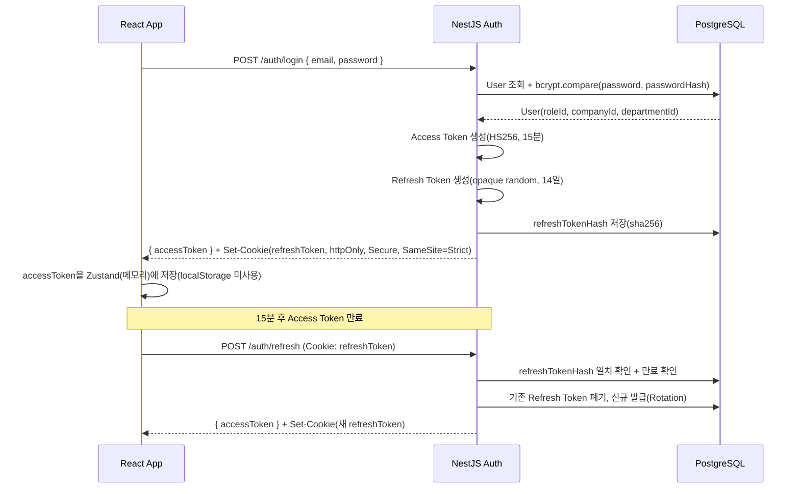

# 12. JWT 인증 설계

## 12.1 토큰 발급 흐름 (Sequence Diagram)



## 12.2 Access Token

- **알고리즘**: HS256 (단일 모놀리식 NestJS 서버 기준). 향후 마이크로서비스로 분리 시 비공개키 공유 없이 공개키로 검증 가능한 RS256로 전환 가능하도록 `JwtModule`을 별도 `AuthTokenService`로 캡슐화.
- **만료 시간**: 15분 — 탈취 시 피해 범위(blast radius)를 최소화하기 위해 짧게 설정하고, Refresh Token으로 무중단 재발급.
- **Payload**:
```json
{
  "sub": "user-uuid",
  "companyId": "company-uuid",
  "roleId": "role-uuid",
  "roleName": "SALES_MANAGER",
  "departmentId": "dept-uuid",
  "iat": 1750300800,
  "exp": 1750301700
}
```
- **중요 설계 결정**: Payload에 **권한(Permission) 목록 전체를 담지 않는다.** 권한 관리 화면([4.7](04-screen-design.md#47-권한-관리-permissions))에서 역할의 권한이 실시간으로 바뀔 수 있는데, JWT에 권한을 캐싱하면 만료 전까지(최대 15분) 변경 사항이 반영되지 않기 때문이다. 대신 `roleId`만 담고, [08-api-design.md](08-api-design.md) 8.3의 `PermissionsGuard`가 매 요청마다 DB에서 `RolePermission`을 조회한다. (15분 TTL을 더 줄이면 변경 반영 속도가 빨라지지만 재발급 트래픽이 늘어나는 트레이드오프가 있음 — 포트폴리오 범위에서는 DB 직접 조회로 충분히 빠르며, 트래픽 증가 시 Redis 캐시 계층 추가가 다음 단계)

## 12.3 Refresh Token

- **형태**: JWT가 아닌 **opaque random token**(`crypto.randomBytes(64).toString('hex')`) — Refresh Token은 클라이언트가 내용을 해석할 필요가 없으므로 자체 정보를 담지 않는 불투명 토큰으로 발급해 페이로드 위조/디코딩 시도 자체를 의미 없게 만든다.
- **저장**: DB에는 원문이 아닌 `sha256` 해시(`User.refreshTokenHash`)만 저장 — DB 유출 시에도 토큰 자체는 복구 불가능.
- **만료**: 기본 14일, "로그인 유지" 체크 시 30일.
- **회전(Rotation)**: `/auth/refresh` 호출마다 기존 토큰을 즉시 폐기하고 신규 토큰을 발급한다. **이미 폐기된(rotation으로 무효화된) 토큰이 재사용되면 토큰 탈취로 간주**하고 해당 사용자의 모든 세션을 강제 종료(`refreshTokenHash = null`) 후 재로그인을 요구한다.
- **클라이언트 저장 위치**: `httpOnly + Secure + SameSite=Strict` 쿠키. JavaScript에서 접근 불가능하므로 XSS로 Refresh Token이 탈취될 가능성을 제거한다. Access Token은 메모리(Zustand, 새로고침 시 휘발)에만 보관하여 `localStorage` 기반 토큰 저장의 고전적 XSS 취약점을 피한다.

## 12.4 RBAC 연계

JWT는 "신원 증명(누가 로그인했는가)"만 책임지고, "무엇을 할 수 있는가"는 [02-users-and-permissions.md](02-users-and-permissions.md)의 RBAC 모델과 [08-api-design.md](08-api-design.md)의 `PermissionsGuard`가 매 요청마다 별도로 판단한다. 이 분리 덕분에:
- 권한 변경이 즉시 반영된다(토큰 재발급을 기다리지 않음)
- AI Function Calling 경로([09-ai-chatbot-design.md](09-ai-chatbot-design.md))에서도 동일한 권한 판단 로직(`RolePermission` 조회)을 재사용할 수 있다 — REST API와 AI 도구 실행이 "이중 권한 체계"로 분기되지 않는다.

## 12.5 Guard 구조

```typescript
// app.module.ts — 전역 인증 가드 등록
providers: [
  { provide: APP_GUARD, useClass: JwtAuthGuard },      // 1차: 모든 요청 인증 필수
  { provide: APP_GUARD, useClass: PermissionsGuard },  // 2차: @RequirePermissions 명시된 라우트만 권한 검사
]
```

```typescript
// common/guards/jwt-auth.guard.ts
@Injectable()
export class JwtAuthGuard extends AuthGuard('jwt') {
  constructor(private reflector: Reflector) { super(); }

  canActivate(context: ExecutionContext) {
    const isPublic = this.reflector.getAllAndOverride<boolean>(IS_PUBLIC_KEY, [
      context.getHandler(),
      context.getClass(),
    ]);
    if (isPublic) return true; // @Public() 데코레이터가 붙은 로그인/리프레시 엔드포인트는 통과
    return super.canActivate(context);
  }
}
```

```typescript
// modules/auth/strategies/jwt.strategy.ts
@Injectable()
export class JwtStrategy extends PassportStrategy(Strategy) {
  constructor(config: ConfigService) {
    super({
      jwtFromRequest: ExtractJwt.fromAuthHeaderAsBearerToken(),
      ignoreExpiration: false,
      secretOrKey: config.get('JWT_ACCESS_SECRET'),
    });
  }

  async validate(payload: JwtPayload) {
    return payload; // req.user에 주입됨 (companyId/roleId/departmentId 포함)
  }
}
```

**가드 실행 순서**: `JwtAuthGuard`(서명/만료 검증) → `PermissionsGuard`(리소스별 권한 검증) → `AuditLogInterceptor`(민감 액션 기록) → Controller. 인증 실패는 401, 권한 부족은 403으로 명확히 구분하여 프론트에서 "로그인 필요" vs "권한 없음" UX를 다르게 처리할 수 있도록 한다.

## 12.6 보안 고려사항

| 위협 | 대응 |
|---|---|
| 비밀번호 평문 저장 | `bcrypt` (cost factor 12) 해싱, 원문은 메모리에서도 즉시 폐기 |
| Brute-force 로그인 시도 | `@nestjs/throttler`로 `/auth/login`에 분당 5회 제한 + 5회 실패 시 계정 5분 잠금([3.1.1](03-feature-spec.md#311-로그인-auth)) |
| Refresh Token 탈취/재사용 | Rotation 전략 + 재사용 탐지 시 전체 세션 강제 종료 |
| XSS로 토큰 탈취 | Access Token은 메모리만 사용(휘발성), Refresh Token은 httpOnly 쿠키(JS 접근 불가) |
| CSRF (쿠키 기반 Refresh) | `SameSite=Strict` + `/auth/refresh` 요청에 커스텀 헤더(`X-Requested-With`) 필수화로 단순 폼 기반 CSRF 차단 |
| 토큰 페이로드 변조 | HS256 서명 검증(`JWT_ACCESS_SECRET`은 GitHub Actions Secret/EC2 환경변수로만 주입, 코드/이미지에 미포함) |
| 권한 변경 지연 반영 | JWT에 권한 캐싱하지 않고 매 요청 DB 조회([12.4](#124-rbac-연계)) |
| 멀티테넌시 데이터 유출 | JWT의 `companyId`를 모든 Prisma 쿼리의 1차 WHERE 조건으로 강제(서비스 레이어 공통 베이스 클래스에서 강제), 장기적으로 Postgres RLS로 2차 방어 |
| 민감 액션 추적 | `AuditLog`에 로그인 실패/성공, 권한 변경, 급여 확정 등을 기록하여 사후 감사 대응 |
