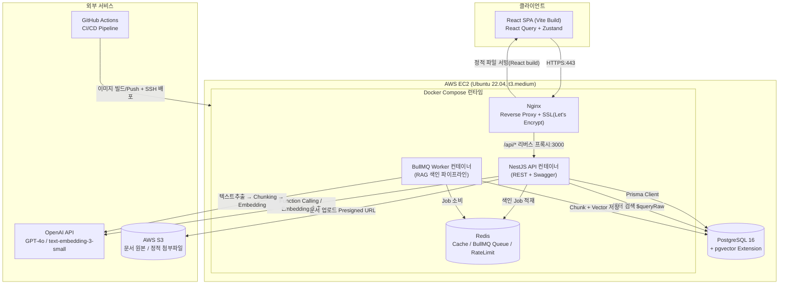

# 13. 시스템 아키텍처

## 13.1 전체 구조도



## 13.2 계층별 설명

### Frontend
- **React 18 + TypeScript + Vite**: Vite의 빠른 HMR로 개발 생산성 확보, 빌드 결과물은 정적 파일로 Nginx가 서빙
- **React Query**: 서버 상태(직원 목록, 재고, 급여 등 API 데이터) 전담 — 캐싱/재요청/Optimistic Update를 일관된 패턴으로 처리
- **Zustand**: 클라이언트 전역 상태(로그인 사용자 정보, Access Token, 사이드바 열림 상태, AI 챗봇 패널 상태)만 담당 — "서버 상태"와 "클라이언트 상태"를 명확히 분리하여 불필요한 전역 상태 비대화를 방지
- **React Router**: 역할 기반 라우트 가드(`<RequireRole roles={['ADMIN']}>`)로 메뉴 접근 제어를 1차로 클라이언트에서 수행(서버 권한 체크가 최종 방어선)

### Backend
- **NestJS + TypeScript**: 모듈식 구조로 도메인별 책임 분리([08-api-design.md](08-api-design.md) 참고), DI 기반 테스트 용이성 확보
- **Prisma + PostgreSQL**: 타입 안전한 쿼리 빌더, 마이그레이션 이력 관리. `vector` 타입은 `Unsupported`로 선언 후 Raw SQL 병행
- **JWT 인증**: Access/Refresh 이중 토큰([12-jwt-auth-design.md](12-jwt-auth-design.md))
- **Swagger**: 모든 엔드포인트 자동 문서화, 프론트엔드 타입 생성 소스로 활용

### Database
- **PostgreSQL 16**: OLTP 트랜잭션(재고/급여/주문)과 **pgvector 확장을 통한 벡터 검색을 단일 DB에서 동시 처리** — 별도 Vector DB(Pinecone, Weaviate 등)를 두지 않아 운영 복잡도와 인프라 비용을 낮춘 의도적 선택([11-pgvector-design.md](11-pgvector-design.md) 11.6 참고)
- **Redis**: (1) BullMQ 기반 비동기 작업 큐(문서 색인), (2) `@nestjs/throttler` Rate Limit 저장소, (3) 추후 권한 캐시 레이어로 확장 가능한 자리

### AI Layer
- **OpenAI API**: GPT-4o(Function Calling/대화 생성), gpt-4o-mini(저비용 라우팅 분류), text-embedding-3-small(임베딩)
- **LangChain**: 텍스트 분할(`RecursiveCharacterTextSplitter`), Agent 루프 오케스트레이션에 활용 — OpenAI SDK를 직접 다루는 저수준 코드와 LangChain의 체인/에이전트 추상화를 적절히 혼용(전체를 LangChain에 종속시키지 않고, Function Calling 루프처럼 세밀한 제어가 필요한 부분은 OpenAI SDK 직접 호출)

### AWS
- **EC2**: 단일 인스턴스에 Docker Compose로 Nginx/API/Worker/Redis 컨테이너 운영(PostgreSQL은 동일 인스턴스 또는 RDS 선택 가능 — 포트폴리오 비용 효율을 위해 EC2 내 컨테이너로 시작, 운영 트래픽 증가 시 RDS로 분리하는 경로를 로드맵에 명시)
- **S3**: 문서 원본 파일 저장(EC2 로컬 볼륨 대비 내구성/백업 용이성 확보)
- **GitHub Actions**: CI(테스트/빌드) + CD(EC2 SSH 배포)

## 13.3 대표 요청 흐름

### (1) 일반 REST 요청 — "재고 목록 조회"
```
Browser → Nginx(HTTPS 종료) → /api/v1/inventory → NestJS
  → JwtAuthGuard(토큰 검증) → PermissionsGuard(INVENTORY:READ 확인)
  → InventoryService → Prisma → PostgreSQL → 응답 직렬화(ResponseInterceptor)
  → Nginx → Browser (React Query 캐시 저장)
```

### (2) AI 챗봇 요청 — "현재 재고가 100개 이하인 품목 알려줘"
```
Browser → Nginx → /api/v1/ai/sessions/:id/messages(SSE) → NestJS AiChatController
  → ChatMessage(USER) 저장 → 1차 라우팅(gpt-4o-mini) → ERP_DATA 분류
  → 도구 목록 필터링(역할 기준) → GPT-4o Function Calling
  → getLowStockProducts 호출 → withRbacScope 강제 → Prisma 조회 → PostgreSQL
  → 결과를 모델에 재주입 → 최종 답변 스트리밍 생성
  → SSE로 토큰 단위 전송 → Browser 챗 UI 실시간 렌더링
  → ChatMessage(ASSISTANT) 저장 + AuditLog(선택적)
```

이처럼 동일한 PostgreSQL/Prisma/RBAC 계층을 REST 경로와 AI 경로가 **공유**하기 때문에, "AI를 통한 조회"와 "화면을 통한 조회"가 항상 동일한 권한 규칙을 따른다는 것이 아키텍처적으로 보장된다.
